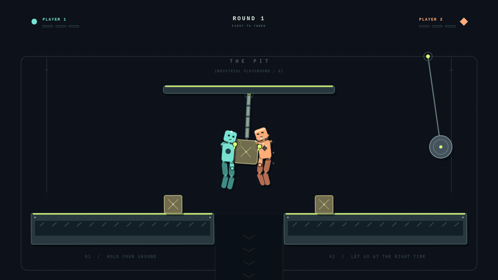

# GrabShift

**Two hands. No punches. Hold on.**

GrabShift is a complete local two-player browser physics brawler. Grab a friend, a ledge, or a swinging crate. Build momentum, release at the right moment, and stay out of **The Pit**. First to three round wins takes the match.



<!-- Screenshot slot: replace docs/screenshot.png with a new 1280 × 720 gameplay capture when the arena changes. -->

## Play

Choose **Play Local**, read the controls, then **Let's Grab**. Both people play on one keyboard. No account, backend, external fonts, remote assets, or network connection is needed after the static game loads.

| Action | Player 1 · circle | Player 2 · diamond |
| --- | --- | --- |
| Move / swing | A / D | ← / → |
| Jump / climb while gripping | W | ↑ |
| Toggle left-hand grip | F | K |
| Toggle right-hand grip | G | L |
| Pause / resume | Escape | Escape |

Tap a hand key to reach. A pulsing hand is armed: it searches within reach and latches once a valid surface comes within its small grip radius. Lime means attached. Tap the same key to let go. Hands work independently and never grab their own body.

Grab opponent limbs, crates, platform tops/sides, the overhead bar, rope links, or the wrecking ball. Jump from the ground to cross the gap. While hanging, steer to pump a swing and tap jump to pull upward. Release in the direction you want to throw; momentum is preserved rather than replaced with an attack animation. A single hand gives more freedom; two give more control. Both players falling on the same simulation check causes a draw and replays the round.

The arena has two platforms, a central pit, an overhead bar, a rope-suspended crate, two loose crates, and a swinging wrecking ball. Falling below the view or far beyond the arena sides loses the round. Matches are first to three, with automatic resets, rematch, and main menu controls.

## Local development

Use **Node.js 22.12+** (Node 22 LTS recommended) and npm.

```sh
npm install
npm run dev
```

Open the address printed by Vite. Two physical players and a desktop keyboard are the intended input setup. Use `npm ci` instead of `npm install` for a reproducible lockfile installation.

```sh
npm run typecheck
npm test
npm run build
npm run preview
```

`npm run build` typechecks and produces `dist/`. Serve that folder with any static HTTP host; do not open `index.html` directly with `file://`.

### Browser tests

```sh
npx playwright install chromium
npm run test:e2e
npm run build
npm run test:production
```

On Linux, `npx playwright install --with-deps chromium` also installs browser OS prerequisites. To use an existing Chromium installation, set `PLAYWRIGHT_CHROMIUM_EXECUTABLE_PATH` to its executable path. The end-to-end suite starts Vite itself. The production smoke test serves the actual build at `/grabshift/` and verifies that repository-subdirectory asset loading works.

Development-only **F3** shows physics outlines, constraints, grab radii, player velocity, and object counts. It starts off and is removed from production along with the `window.__GRABSHIFT__` inspection hook. Do not make gameplay depend on that hook.

## GitHub Pages

The included `.github/workflows/pages.yml` handles installation, build, artifact upload, and Pages deployment for pushes to `master` or `main`. It calls the reusable CI workflow first; a failed typecheck, physics test, browser test, or production smoke test prevents deployment. Pull requests run the same CI separately.

In the repository's **Settings → Pages**, choose **GitHub Actions** as the publishing source. Then a push to `master`/`main`, or running the **GitHub Pages** workflow manually, publishes the game. This is a repository setting; no source file changes or credentials in the project are needed. The relative Vite base (`./`) supports both a project URL such as `/grabshift/` and a custom-domain root.

The deliverable includes the workflows; creating this archive does not push, publish, or configure a GitHub repository.

Each successful CI run also publishes a **grabshift-source** artifact containing `grabshift.zip`. Open the run in the repository's **Actions** tab and download that artifact. GitHub wraps artifacts in an outer ZIP; extract it to obtain `grabshift.zip`, whose project root is `grabshift/`. GitHub requires sign-in to download Actions artifacts. To create the same source archive locally, run `python3 scripts/package-release.py` (Python 3 required only for packaging).

## Architecture

```text
src/
  main.ts                    Application entry; development-only inspection hook
  style.css                  Responsive HTML menus, dialogs, and HUD
  ui/UI.ts                   Main menu, controls, settings, pause, results
  game/
    Game.ts                  Phaser Canvas renderer and fixed logical resolution
    config.ts                World dimensions, physics tuning, input types
    scenes/GameScene.ts      Lifecycle, fixed-step loop, round/UI coordination
    entities/Ragdoll.ts      Ten rigid bodies, nine joints, balance and movement
    entities/Hand.ts         Independent grip state and hand position
    arenas/PitArena.ts       Arena bodies, suspension rig, and wrecking ball
    rendering/ArenaRenderer.ts  Original vector art and development overlay
    systems/Simulation.ts   Headless Matter world; reset and disposal
    systems/GrabSystem.ts   Nearest surface detection, reach, grip constraints
    systems/InputSystem.ts Keyboard edges and held movement
    systems/RoundSystem.ts Countdown, scoring, draws, and match state machine
    systems/EffectsSystem.ts Bounded particles, flashes, shake, throw slowdown
    systems/SoundSystem.ts Original Web Audio cues
    systems/Settings.ts     Validated local preferences
    utils/physics.ts        Geometry, body metadata, and soft angular servos
tests/                      Deterministic tests using the real Matter simulation
e2e/                        Playwright tests using the real browser and keyboard
scripts/production-smoke.mjs Built-site test under a repository subdirectory
public/                     Original local SVG illustration and icon
```

Phaser 3 handles rendering and the game lifecycle. Standalone Matter.js drives a fixed **60 Hz** simulation independent of rendering, making physics tests use the same code as gameplay. A bounded accumulator prevents runaway catch-up after stalls. Logical coordinates remain 1280 × 720 as the view scales with letterboxing.

Movement uses body forces. Soft angular servos and a grounded suspension force help the characters stand; jumping changes velocity as an impulse. Airborne bodies remain physical. Grip constraints retain body momentum on release. Collision intensity uses relative velocity projected onto the contact normal. Minor contacts do not trigger effects. Particles are capped, sound nodes disconnect after each cue, and resets rebuild only the physics world without registering new listeners.

### Tuning

Start in `src/game/config.ts`. Movement force, air control, jump speed, coyote time, grip radius, constraint stiffness, and posture settings are grouped there. Body dimensions/materials and balance forces live in `Ragdoll.ts`; environmental mass and suspension live in `PitArena.ts`. After changing physics, run the deterministic tests and browser suite, then try moving, jumping, hanging, and releasing with both players. Preserve constraints and velocity; avoid position-based character control.

## Accessibility and scope

- Players have distinct circle/diamond badges and different faces/head markings as well as colors.
- Menus support keyboard focus; pause and round announcements have semantic HTML.
- Sound, volume, and reduced motion are saved locally. Private browsing/storage failures fall back to in-memory settings.
- Focus loss automatically pauses a match to avoid stuck keys or unattended falls.
- This MVP has one arena, local keyboard multiplayer, and no AI, online multiplayer, touch controls, or gamepad support.
- Hardware keyboard ghosting can limit simultaneous keys. A keyboard with good rollover is recommended.
- Automated browser validation targets Chromium. Other current desktop browsers should support the APIs used, but have not all been release-tested. Gameplay itself is visual and not fully screen-reader playable.

## Contributing

Open an issue describing a reproducible behavior or propose a focused pull request. Run `npm run check`, `npm run test:e2e`, and `npm run test:production` before submitting. Add a physics or browser regression test when fixing behavior. Keep original art local, avoid new runtime dependencies unless justified, and preserve frame rate and clear controls. Do not commit `node_modules`, `dist`, test traces, caches, or secrets.

## Credits and license

Code, original SVG illustrations, procedural game graphics, and synthesized sounds are distributed under the [MIT License](LICENSE). Copyright © 2026 Lakshmi Narayanan Sridharan. Phaser and Matter.js are MIT-licensed open-source dependencies. See [THIRD_PARTY_NOTICES.md](THIRD_PARTY_NOTICES.md) for their runtime notices. No third-party game assets are used.
